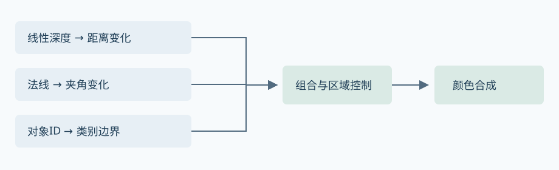
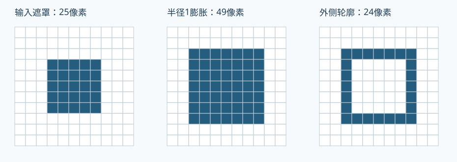

# 描边

给一个模型加上描边，最容易想到的做法是沿着它的外轮廓画一圈线。但真正做起来，很快就会遇到几个不同的问题：外轮廓画出来了，衣服上的结构线却没有；球体的轮廓连续，立方体的角上却裂开；近处线宽合适，相机拉远以后又显得太细。

这些问题都与“线从哪里来”有关。模型几何能提供一部分边缘，屏幕上的深度、法线和对象遮罩能提供另一部分，而有些细节只能由美术指定。我们从这些输入开始，沿着几何壳和屏幕检测两条主要路线，把轮廓怎样生成、哪里容易出错，以及怎样验证逐步说清楚。

## 轮廓从哪里来

先看一个立方体。相机转动时，哪些边把物体与背景分开会随之变化，这些边构成可见的外轮廓。立方体表面的棱线则来自相邻面的方向差异，即使它们落在物体内部，也可能值得画出来。

衣服缝线又是另一种情况。它可能只画在贴图里，周围的几何、法线和深度都没有明显变化。仅凭网格或深度做边缘检测，就找不到这条线。所以在选算法之前，我们先把想画的线与它依赖的数据对应起来。

| 要画的线 | 可用信号 | 典型限制 |
|---|---|---|
| 外轮廓 | 扩张几何壳、对象遮罩边界、深度差 | 开放网格、遮挡和分辨率影响结果 |
| 折角 | 相邻面夹角、几何法线变化 | 平滑法线和法线贴图会改变检测结果 |
| 材质或对象分界 | 离散ID、材质遮罩 | 同ID接触面需要额外信息 |
| 艺术指定细节 | 手绘线、SDF、顶点权重 | 依赖资产制作与采样精度 |

实际效果往往会组合几种方法：几何壳负责外轮廓，贴图负责衣服结构线，屏幕检测再补上场景里的接触边。组合以后，某条多余的线究竟来自深度、法线还是贴图，单看最终颜色很难判断。把各方法的输出分别显示出来，就能沿着输入找到它的来源。

## 几何壳描边

外轮廓可以从模型本身得到。我们先额外绘制一层向外扩张的模型，再让原表面挡住这层模型的中间部分，留下边缘。这就是几何壳描边的基本思路。它很容易起步，但宽度、硬边和遮挡都会影响这层壳最终露出多少。

### 沿法线外扩，再绘制背面

把模型再画一次，在顶点阶段沿法线向外移动，并把颜色设为描边色。这里如果把扩张壳的正面也画出来，它很容易覆盖原来的表面。因此描边通道使用`Cull Front`剔除正面，只保留背面。对于闭合网格，这些背面大多位于原表面后方，深度测试挡住中间部分，边缘才会露出来。

最简单的对象空间外扩是：

$$\mathbf p'_{OS}=\mathbf p_{OS}+w_{OS}\hat{\mathbf n}_{OS}$$

这里的`wOS`使用模型坐标的单位，所以它会跟着模型一起缩放。在透视相机下，同样的外扩距离投影到远处只占更少的像素，轮廓看起来也就更细。这个简单版本已经足够让我们看清壳是怎样形成的，再逐步检查剔除、深度和外扩方向。

在下面的最小实现中，本体先作为不透明物体写入深度，壳随后以`Cull Front`、`ZWrite Off`、`ZTest LEqual`绘制。壳用已有深度判断哪些部分可见，同时保留本体写下的深度。

不过，“背面位于本体后面”在凹面、开放边界或自交网格上未必成立，外扩过宽也可能让壳越过其他表面。看到局部遮挡错误时，先保留真实的深度测试，单独查看壳的位置。这样才能判断问题来自几何越界，还是绘制状态。

### 先解决硬边裂缝

硬边处会出现裂缝，因为同一个位置通常存在多个法线不同的顶点。沿各自法线外扩后，这些顶点会向不同方向移动，于是原本相连的轮廓被拉开。

既然裂缝来自方向不一致，让接缝上的顶点沿同一个方向移动就能把它们重新接起来。但着色法线之所以分开，正是为了保留硬边的光照。直接平滑这份法线，轮廓可能连续了，原来的棱角明暗却也会改变。

因此我们给描边单独准备一份外扩方向，原着色法线继续负责光照。烘焙这份方向时，在对象空间找到属于同一轮廓接缝的顶点，再让它们共享结果。位置比较带上容差，是为了处理浮点误差；同时检查拓扑所属，是因为两块独立表面可能恰好相交。它们位置相同，却不一定应该连成同一条轮廓。

#### 权重累加完成后再归一化

顶点分好组以后，还要决定这个组沿哪个方向外扩。做法是把参与面的方向加起来，再归一化；如果某些面贡献更大，就给它们更大的权重：

$$\mathbf n_{outline}=\operatorname{normalize}\left(\sum_i a_i\mathbf n_i\right)$$

这里的`ni`是参与面的方向，`ai`是它的权重。如果直接按三角形数量平均，网格切得更密的一侧可能占据更大贡献。面积权重能减少这种小三角形重复贡献；角度权重则能减少局部重划分对结果的影响。

所以烘焙输入最好从选定面片的法线和权重出发。直接累加拆分后的顶点法线也能得到一个方向，但UV接缝或硬边产生的副本越多，那一侧的贡献就可能越大。这里的权重已经受拆分规则影响，确认副本怎样产生，才能解释算出的方向。

下面的Python参考函数接收同组方向和非负权重。它先完成累加，最后只归一化一次，这样交换遍历顺序也会得到相同结果。

```python
def smooth_group(normals, weights):
    total = tuple(sum(n[axis] * w for n, w in zip(normals, weights))
                  for axis in range(3))
    length = sum(value * value for value in total) ** 0.5
    if length < 1e-12:
        raise ValueError("无法确定外扩方向")
    return tuple(value / length for value in total)
```

用三个互相垂直的单位方向试一下，结果就是归一化后的`(1,1,1)`。如果每次加一项就归一化，前面累计量的长度会被反复改为一，后加入的方向相对它的权重也随之改变，最终结果就会依赖顺序。[reference.py](../examples/outline/reference.py)保留了这个检查，也补上输入长度和权重的检查。

#### 数据通道与蒙皮

方向算出来以后，Shader还得读到它。选择存储通道时，先看哪些属性已经被材质和资产管线占用，再决定愿意用多少带宽和精度换这份数据。

| 存储方式 | 前提 | 要检查的代价 |
|---|---|---|
| 顶点色 | 选择8位或浮点格式，确认原有遮罩用途 | 方向量化、顶点带宽、通道占用 |
| UV属性 | Unity `SetUVs`支持索引0–7与2/3/4分量 | 布局与精度；两分量可用八面体编码 |
| 切线 | 资产不使用该通道的法线贴图契约 | 与切线、手性和导入处理冲突 |
| 独立缓冲 | Shader能按顶点或实例索引读取 | 绑定、索引一致性和生命周期 |

比如把方向写入8位顶点色，量化会改变三个分量的比例，解码后的长度也未必仍是一。因此读取后再归一化，让外扩距离继续由宽度参数决定。至于8位精度够不够，近景斜边和高曲率网格会比平滑球体更容易暴露误差，用它们检查线宽和方向更有意义。

静态模型的处理比较直接：对象空间中的描边方向跟着对象变换就够了。角色做了蒙皮以后，表面会随骨骼弯曲，外扩方向也得跟着变化。单纯把方向存进UV做不到这一点，因为UV里的数值不会自动参与蒙皮。

一种做法是把方向存成切线空间数据，蒙皮完成后再用变形后的基底恢复它；另一种是明确对这份方向执行蒙皮。

另外，模型存在非均匀缩放时，方向的变换也不能直接按普通向量处理。这里遵循法线的变换规则，使用逆转置矩阵，再重新归一化，才能保持方向与变换后的表面关系。

LOD切换时，网格拓扑和顶点属性布局都可能变化，同一份顶点方向也就不能直接套到每一级。因此每级LOD分别烘焙，再观察切换时的轮廓是否连续。把算法、容差、权重和版本记在自动导入步骤里，资产重导入时才有依据复现相同结果。

### 让宽度以像素计

到这里，壳的方向已经有了，但对象空间宽度还会随距离变细。如果目标是让线条始终占几个像素，就从屏幕位移反推裁剪坐标中的偏移。

裁剪坐标除以`clip.w`才得到NDC，因此直接加到裁剪坐标里的固定偏移，最后也会除以`clip.w`。为了让透视除法后的位移保持`k`个像素，我们先把像素位移换成NDC，再乘回`clip.w`：

$$\Delta\mathbf p_{clip,xy}=\left(\frac{2k d_x}{W},\frac{2k d_y}{H}\right)p_{clip,w}$$

`(dx,dy)`表示像素空间的单位方向，`W,H`是当前渲染目标的宽高。这样算出的宽度对应当前目标里的像素。如果后面还有升采样，一个渲染像素会对应更多显示像素，所以想控制最终画面里的宽度，还要把分辨率比例算进去。

```hlsl
float4 OffsetOutlinePixels(float4 clipPosition, float2 pixelDirection,
                           float widthPixels, float2 renderSize)
{
    float lengthSquared = dot(pixelDirection, pixelDirection);
    if (lengthSquared < 1e-8)
        return clipPosition;
    float2 direction = pixelDirection * rsqrt(lengthSquared);
    clipPosition.xy += direction * (2.0 * widthPixels / renderSize)
                       * clipPosition.w;
    return clipPosition;
}
```

这段API中立HLSL只负责按像素偏移，传入的方向由调用者构造。例如，把外扩方向变到视空间，再用投影矩阵的XY线性部分投影，最后按目标宽高换成像素方向。对于普通无斜切的透视或正交矩阵，这是一种稳定的方向近似。

不过，法线正对相机时，投影到XY平面的方向会趋近零。此时归一化容易放大数值误差，所以函数跳过这次偏移。它避开了不稳定计算，但附近的顶点仍可能出现线宽不连续，观察角点时要把这类情况与硬边裂缝分开。

顶点在屏幕上移动了固定像素，整层壳露出的轮廓却未必处处一样宽。模型角点、投影变形和遮挡都会改变几何覆盖，这也是几何壳与二维遮罩膨胀的区别。目标是严格的屏幕形状时，遮罩膨胀更容易控制。

固定像素宽度还有一个直观后果：物体越来越远、越来越小，线却没有一起变细，最后可能盖住物体本身。给宽度加距离衰减和上下限，就是在这两种要求之间取舍：近景线条清楚，远景也保留足够的主体面积。

### 深度与模板控制

外扩方向和线宽确定以后，剩下的问题是让壳在正确的地方出现。局部壳面露进本体，或者多个物体重叠时轮廓消失，都要回到深度与覆盖关系来看。深度偏移和模板遮罩分别控制这两类信息。

#### 深度偏移改变可见性

如果扩张壳的某一部分与本体深度太接近，把壳沿视方向推远一点，能减少局部冲突。另一个选择是在光栅阶段施加深度偏移。两者都能改变深度测试结果，但前者通过视空间位置改变投影深度，后者依据深度斜率和设备深度分辨率调整测试值。具体语义见[Unity Offset](https://docs.unity3d.com/6000.0/Documentation/Manual/SL-Offset.html)与[Vulkan深度偏移](https://docs.vulkan.org/spec/latest/chapters/primsrast.html#primsrast-depthbias)。

这种修法依赖偏移量。推得太远，本来位于后方的物体可能穿过轮廓，局部冲突解决了，物体间的遮挡又出了问题。调参时把前后遮挡物留在场景里，比较本体、壳和遮挡物的深度，才能看到这个代价。

Reversed-Z和不同API会改变偏移符号及数值条件，所以深度偏移要放在具体约定下理解。裁剪空间Z也依赖投影，把它直接用作距离衰减，相同数值在不同约定下未必代表同样的距离关系。

#### 模板记录本体覆盖

如果目标是让轮廓留在本体覆盖之外，模板可以直接记录这份覆盖。先画本体，在通过深度测试的像素里写下标记；再画壳，排除已经标记的区域。这样壳即使覆盖了本体像素，也会被模板测试挡住。

下面的ShaderLab状态用`0x10`这一位记录本体。示例假设描边独占该位，当前相机已在合适阶段把它清零，后续也没有其他通道改写。壳读到的标记才会对应本体覆盖，避免混入残留或其他效果的数据。

```text
// 本体通道
Stencil { Ref 16 ReadMask 16 WriteMask 16 Comp Always Pass Replace }
// 壳通道：读取标记，保留模板内容
Stencil { Ref 16 ReadMask 16 WriteMask 0 Comp NotEqual Pass Keep }
```

一个对象时，这个规则很容易理解。多个对象共用一位以后，模板只记得“这里有本体”，已经分不清是哪一个对象。两个对象重叠时，它们会形成联合遮罩，原本想保留的内部遮挡线也可能一起被排除。

要保留对象之间的差异，就得把这份身份信息留下来。逐对象清理和绘制是一条路径，用对象ID配合深度定义边界是另一条路径。ID的位数有限，而且它只说明像素属于谁；绘制顺序与深度仍决定谁遮挡谁。因此只换一个`Ref`值，还不足以覆盖所有重叠情况。

模板也可能被延迟光照、UI遮罩等效果使用。它们若写到同一位，描边读到的标记就会改变，所以位分配是这条方案的一部分。通用比较和写掩码见 [[02_GPU与光栅化管线/Stencil与对象遮罩]]。来源文章里的重叠对比可以帮助观察现象，实际接入时仍要验证自己的对象顺序与深度条件。

### 图元生成的另一条路径

几何壳是把整个模型扩张后，让覆盖关系留下轮廓。如果手里有网格邻接信息，也可以直接寻找轮廓边，再沿这些边生成线段或四边形。例如，共边两侧的面相对视线朝向不同，就能成为候选轮廓边；生成后仍要判断遮挡，并把相邻线段接起来。

线段一旦成为独立几何，就能携带自己的宽度、UV和端点属性，控制也更细。代价是维护邻接、处理接缝，以及限制生成的几何数量。几何着色器、离线预处理和Compute都能承担其中的生成工作，具体路径取决于API、已有数据和放大量。阶段机制见 [[02_GPU与光栅化管线/Geometry Shader]]、[[02_GPU与光栅化管线/Stream Output]]，硬件成本则由目标平台测量。

## 结构线与表面边缘

外轮廓有了，模型内部却未必出现足够的结构。衣服缝线、发束分界或面部细节可能根本没有对应的几何边，继续扩大壳也画不出它们。这时我们从资产指定的数据，或表面随视角变化的信号中寻找线条。

### 手绘线、SDF与顶点权重

把线直接画进贴图，可以准确指定衣服缝线和发束分界。问题在采样：近看时斜线容易露出锯齿，远看时Mip过滤又可能把细线变淡或抹掉。

SDF把这份数据改为到线边界的距离，Shader通过阈值决定线画到哪里，再用导数平滑边缘。这样宽度有了数值控制，但距离的尺度和Mip生成规则也要一起约定，否则换一级Mip，同一个阈值可能对应不同的线宽。

另一种选择是把SDF或宽度权重存在顶点属性中，让插值后的数据控制线条。这样减少了纹理依赖，但网格只有这些采样点，线条的形状也会受顶点密度与插值限制。

UV岛边界同样能用来生成线，不过UV往往是为了展开和采样而拆开，接缝未必就是画面里的衣服结构。离线生成之前先确定哪些接缝值得画，才能让生成结果符合线条的用途。

### 法线与视线夹角

如果只想让表面靠近侧面的区域出现一条色带，法线与视线的夹角就能提供信号。表面越转向侧面，两者的点积越接近零，把这个区间映射为遮罩就能得到边缘带：

```hlsl
float ndotv = saturate(dot(normalize(normalWS), normalize(viewDirWS)));
float rimMask = 1.0 - smoothstep(rimLow, rimHigh, ndotv);
```

这段代码比较同一世界空间里的法线和视线，阈值满足`rimLow < rimHigh`。球体的法线连续转向，很容易形成一圈边缘带；平面就不同，转到侧面以后可能整块一起变色。

法线贴图也会改变这份遮罩，所以它适合表现材质表面的掠射效果。要画精确的物体外轮廓，几何或对象遮罩提供的信息更直接。

## 屏幕空间描边

几何和资产数据都能画线，但场景已经渲染完成时，我们还可以直接看屏幕上的变化：相邻像素的深度突然跳变，可能是前后物体的边界；法线发生变化，可能是表面的折角。找出这些变化，生成边缘遮罩，再合成到颜色，就得到屏幕空间描边。

这条路径直接在像素上工作，也能补出一部分内部结构。它的限制同样来自输入：缓冲没有保存的物体或细节，后处理就无从恢复。下面分别看深度、法线和对象信息能解决哪些问题。



图：三种输入分别生成边缘，再经过区域遮罩控制，合成到颜色。这里画的是数据依赖，实际通道是否合并、资源如何驻留，仍由引擎与API决定。

### 深度不连续

深度检测先解决数值的含义。设备深度依赖投影与API约定，直接相减的尺度难以统一，所以先把它还原成正的视空间距离，再比较中心与邻居。

即使换成距离，同样的绝对差值在近处和远处也有不同意义。下面把差值除以两者较近的距离，让检测依据相对变化量，减少远近尺度带来的差异：

```hlsl
float OutlineRelativeDepth(float centerDepth, float neighborDepth,
                          float minimumScale)
{
    return abs(neighborDepth - centerDepth)
           / max(min(centerDepth, neighborDepth), minimumScale);
}
```

分子和分母都使用距离单位，因此输出和阈值无单位。`minimumScale`也使用同样的距离单位，用它给分母设置下限。

不过，一块倾斜的地面也会让相邻像素出现深度差。相对差值改善了距离缩放，却没有告诉我们“这是连续斜面还是两个物体”。把斜面校正、法线或ID加入判断，才有更多信息排除这类误判。背景像素没有有效表面深度时，则先看覆盖标记，避免把无效值当成距离比较。

只沿横竖方向做差分，斜边的响应可能与水平边不同；Sobel等邻域算子提供了另一种组合相邻样本的方式。采样距离也会影响检测范围，但它与扩张已有轮廓是两步不同的操作：边缘检测寻找不连续，轮廓膨胀决定这些边向外占多少像素。深度约定与重建见 [[02_GPU与光栅化管线/深度缓冲与位置重建]]。

### 法线不连续

如果两个面深度连续，只用深度可能漏掉它们之间的折角。法线正好补充了表面朝向：两个单位法线的点积等于夹角余弦，用`1-dot(N0,N1)`就能衡量方向变化。

但法线也有不同来源。平滑法线会减弱折角，带法线贴图的着色法线又会出现高频变化，检测后可能满是细碎线。因此先看缓冲里保存的是几何法线还是着色法线，才能知道这些变化代表模型结构，还是材质表面的细节。

```hlsl
float OutlineNormalEdge(float3 centerNormal, float3 neighborNormal)
{
    return 1.0 - clamp(dot(normalize(centerNormal), normalize(neighborNormal)),
                       -1.0, 1.0);
}
```

这段函数中，相同方向得到零，反向得到二。用一个夹角已知的网格显示输出，可以把阈值与实际折角对应起来。两份法线比较之前采用相同的解码和空间约定，否则数值差异可能只是坐标不同。

轮廓边缘还会遇到背景样本，它没有有效表面法线。先检查覆盖和深度有效性，再决定怎样处理这个邻居，才能把表面折角与物体边界分开。

### 对象遮罩与ID

深度和法线说明表面的位置与方向，却不一定能说明像素属于哪个对象。只想给选中物体画一圈外线时，单独把它渲染成二值遮罩会更直接：物体内为一，物体外为零。

把这张遮罩`M`向外膨胀，再减去原遮罩，内部像素被减掉，只剩新扩出去的部分，也就是外侧轮廓：

$$O=\max(\operatorname{dilate}(M)-M,0)$$

如果用模糊后的遮罩减原遮罩，外侧得到的是渐变软边。膨胀则通过核的半径直接控制扩张范围：方形核会把角点扩成方形，圆形核更接近径向线宽。要选哪种核，既看目标轮廓的形状，也看邻域采样的成本。



图：11×11区域里放入一个5×5方块，使用半径1的方形核膨胀，再与原遮罩相减，外侧留下24个像素。这是CPU参考算法的结果；Shader采样和抗锯齿可能影响最终覆盖，接入后再对照检查。

多个对象画进同一张二值遮罩以后，它只记录物体的联合覆盖。两个对象相互接触，内部边界不会出现在这张遮罩里。想保留这条边，就用离散ID记录对象身份，再配合深度确定遮挡关系。

ID处理的是类别。线性过滤把相邻ID混起来，结果可能不再属于任何原对象；MSAA resolve和TAA历史若按普通颜色平均，也会遇到同样的问题。因此ID使用整数或明确的离散编码，并以点采样等方式保持类别含义，后续处理也沿这份含义设计。

如果目标是透过遮挡看到选中对象，场景最近深度仍然不够：前方物体已经挡住了后方信息。这时单独的对象遮罩或Custom Depth提供后方对象的数据，再决定透视线怎样显示。普通轮廓遵守场景遮挡，透视线有另一套可见性规则，参数和图注把目标说明白，测试才有明确判据。

### 放在时域处理的哪个位置

边缘检测完成后，还要决定线条在哪个阶段合成。放在TAA之前，线条能一起参与历史累积，但移动或遮挡变化也可能留下拖影。放在TAA之后，线条保持锐利，输入深度和法线是否对齐却会更直接地影响结果。

一像素线尤其容易暴露问题：投影抖动、渲染分辨率或最终显示尺寸变化，都可能让它跨到相邻像素。把合成位置改到另一个阶段，未必就能消除这种变化。

排查时沿着同一个表面追踪边缘输出、运动向量和历史校验，确认它们使用同一坐标约定。移动细线、遮挡揭露、相机旋转与动态分辨率分别引入不同变化，分开测试才容易看出哪个环节失配。具体流程见 [[02_GPU与光栅化管线/抗锯齿与时域重建]]；其中深度、ID与颜色历史各有自己的含义，不能只按颜色累积的方式处理。

## 方案选择与工程代价

到这里，每条路径能画出的线已经比较清楚了。画模型外轮廓，几何壳是直接的起点；画衣服上的指定细节，手绘数据更容易控制；画场景里的折角或选中对象边界，就看深度、法线和对象信息是否齐全。目标确定后，再把这些能力与代价放在一起比较。

| 方案 | 擅长的目标 | 主要成本与限制 |
|---|---|---|
| 几何壳 | 模型外轮廓、逐顶点控制 | 额外Draw、顶点、蒙皮和覆盖；开放网格、凹面需处理 |
| 显式边几何 | 线段UV、端点和折角控制 | 邻接数据、连接规则、输出规模和平台支持 |
| 手绘/SDF | 精确的艺术结构线 | 资产制作、UV、距离尺度和过滤 |
| 深度/法线检测 | 场景边界和折角 | 全屏采样、噪声、最近表面信息限制 |
| 遮罩/ID | 选中轮廓、对象边界 | 额外数据通道、离散分类与遮挡定义 |
| 掠射色带 | 材质表面边缘效果 | 受法线和视角影响，轮廓形状有限 |

算法决定线能从哪里产生，线宽和取舍则决定画面最后是什么样。外轮廓与内部线不一定同样粗，距离、材质、曲率和艺术权重也都能参与控制。等宽线和有粗细变化的线各有适用画面，把这些参数放回目标风格里校准，才有清楚的依据。

调效果时可以先只看外轮廓，确认主体形状已经清楚，再逐步加入内部线。这样更容易发现哪些细节增加了结构，哪些只是增加了高频信息，反而把主体淹没。

性能也沿着同一条执行路径来看。几何壳额外画一次模型，可能重复蒙皮、顶点变形、透明裁剪和各Submesh的绘制。屏幕方案把工作放到纹理读取与中间目标上，输入没有现成ID或遮罩时，还得额外生成这些数据。

因此比较方案时，把线条覆盖、Pass、目标尺寸与格式一起记录，才能解释耗时为什么变化。局部描边通道的时间和整帧时间分别观察，避免只看到其中一个环节的变化。

## 最小实现与验证

这些机制可以先拆成小实验验证，再接入引擎看实际画面。参考算法能检查方向、位移和遮罩的数值关系；引擎里则还要确认资源、绘制状态与目标模型。两层结果放在一起，才知道错误发生在算法还是接入过程。

### 本机参考实验

从仓库根目录运行下面的命令。第一条执行CPU参考实验，后两条分别编译顶点和像素入口：

```powershell
python 知识库/examples/outline/reference.py --out 知识库/examples/outline/build
dxc -T vs_6_0 -E OutlineVS 知识库/examples/outline/CompileProbe.hlsl -Fo 知识库/examples/outline/build/outline-vs.dxil
dxc -T ps_6_0 -E OutlinePS 知识库/examples/outline/CompileProbe.hlsl -Fo 知识库/examples/outline/build/outline-ps.dxil
```

Python实验使用3.10以上版本，只依赖标准库。运行后得到`mask.pgm`、`outline.pgm`和结果JSON，可以直接检查遮罩怎样扩张，以及法线顺序、权重、像素尺度和深度比例的测试结果。

HLSL编译探针使用列向量矩阵约定，检查API中立函数能否编译。它没有建立实际数据绑定、渲染目标和绘制状态，这些由接入工程提供。因此编译成功以后，还要在工程里看数据与画面，才能验证最终效果。

已经执行的检查和工具版本列在下方“证据范围”。重复实验时把自己的结果与环境一起留下，后续换模型或引擎版本，才能分清差异来自测试条件，还是实现本身。

### Unity 6 URP接入路线

接入引擎时，我们先用最简单的壳观察绘制关系。下面的路线使用Unity 6000.0、URP17和Universal Renderer，通过[Render Objects Renderer Feature](https://docs.unity3d.com/6000.0/Documentation/Manual/urp/renderer-features/renderer-feature-render-objects.html)额外绘制模型。

[StaticHull.shader](../examples/outline/StaticHull.shader)保留完整Shader，只用原法线和对象空间宽度。这个版本先针对静态闭合网格：球体能帮助确认整体覆盖，硬边立方体则能暴露方向裂缝，两个输入放在一起更容易观察前面解释的差别。

1. 将Shader复制进测试项目，创建使用该Shader的描边材质。球体与立方体使用普通不透明材质，并放入单独Layer。
2. 在相机使用的Renderer Data中添加Render Objects，事件设为`AfterRenderingOpaques`，筛选该Layer与Opaque。若设置Pass Names，匹配测试本体Shader的LightMode。
3. Override Mode选择Material，指定描边材质。深度和模板覆盖先关闭，让Shader内的`Cull Front`、`ZWrite Off`、`ZTest LEqual`生效。
4. 从小的`_OutlineWidthOS`开始，确认原模型正常绘制，额外通道只输出壳。相机靠近和远离时，像素宽度应变化。
5. 用Frame Debugger定位额外Draw，检查材质、剔除和深度状态。球体通常连续，硬边立方体暴露裂缝；随后接入独立平滑方向再比较。

这条路线依据官方功能文档组织，`StaticHull.shader`尚未在Unity完整工程中导入编译或运行。复现时最好把Unity补丁和URP包版本一起记下来。后面如果接口或画面出现差异，就能先核对是不是版本因素。

静态网格确认以后，再逐项加入多相机、XR、MSAA、蒙皮、负缩放和透明对象。它们会改变相机数据、资源或几何条件，一次加入太多变化就很难定位原因。通用图通道接入见 [[22_渲染引擎实现/URP Render Graph自定义Pass]]。

### 故障与回归

画面错误通常能落到某份输入或某个状态上。整个物体被涂成描边色，与硬边裂缝的原因就不同：前者先看本体和壳怎样覆盖，后者看接缝顶点往哪里移动。按症状缩小范围，再单独显示对应数据，比反复调整所有参数更容易找到原因。

| 症状 | 先检查 | 验证或修法 |
|---|---|---|
| 整个物体变成描边色 | 本体Draw、Cull、深度与顺序 | 单独显示本体/壳，确认原深度写入 |
| 硬边裂缝 | 重合顶点方向和焊接归属 | 输出方向RGB，比较组内方向 |
| 动画时轮廓脱离 | 独立方向是否变形、Pass是否共用动画 | 静态姿态与极端关节姿态对照 |
| 远景粗线盖住细物体 | 像素线宽与显示/渲染尺寸 | 加宽度上下限，验证不同render scale |
| 地面满是轮廓 | 深度编码、斜面梯度与阈值 | 分别输出深度、法线、ID检测结果 |
| 对象重叠处线消失 | 联合遮罩、模板位与对象顺序 | 独立ID和深度对照，明确要画的边 |
| TAA拖影或抖动 | 注入阶段、运动向量和历史拒绝 | 固定相机、移动物体、遮挡揭露分别测 |

检查性能时，保持相机、构建、分辨率和网格一致，再分别关闭壳、屏幕检测、内部线与ID生成。每次只减少一条路径，耗时变化才更容易对应到实际工作量。把设备、驱动和统计窗口与结果一起保存，后续比较也就有相同的条件。

### 证据范围

2026-10-07，本机使用Python3.12执行了43组CPU算法与数值检查，结果通过；使用DXC1.9.0.5399编译`OutlineVS`和`OutlinePS`也通过。这些结果分别支持参考算法的测试关系，以及API中立HLSL函数和探针的编译。

Unity导入编译、引擎运行、GPU捕获与性能测量尚未执行。`StaticHull.shader`提供上述环境下的接入路线，实际图形效果与性能仍由目标工程的运行结果验证。

## 相关主题

- [[11_NPR与风格化渲染/NPR与场景风格导读]]
- [[11_NPR与风格化渲染/NPR材质与分层光照]]
- [[02_GPU与光栅化管线/Stencil与对象遮罩]]
- [[02_GPU与光栅化管线/深度缓冲与位置重建]]
- [[09_动画系统/骨骼动画与蒙皮]]
- [[14_性能分析与优化/性能对照实验]]

## 参考资料

- 别看着我笑了，[风格化渲染常用技巧总结：描边](https://zhuanlan.zhihu.com/p/603649633)。用于方案与工程现象线索；代码与状态独立核验，来源图片许可尚未确认。
- Unity6000.0，[Mesh.SetUVs](https://docs.unity3d.com/6000.0/Documentation/ScriptReference/Mesh.SetUVs.html)：通道索引与属性分量。
- Unity6000.0，[Stencil](https://docs.unity3d.com/6000.0/Documentation/Manual/SL-Stencil.html)、[Offset](https://docs.unity3d.com/6000.0/Documentation/Manual/SL-Offset.html)：状态、掩码与深度偏移。
- Unity6000.0，[Render Objects](https://docs.unity3d.com/6000.0/Documentation/Manual/urp/renderer-features/renderer-feature-render-objects.html)：筛选、材质和状态覆盖。
- Khronos，[Vulkan Depth Bias](https://docs.vulkan.org/spec/latest/chapters/primsrast.html#primsrast-depthbias)：光栅阶段深度偏移条件。
- 本仓库 [OutlineMath.hlsl](../examples/outline/OutlineMath.hlsl)、[reference.py](../examples/outline/reference.py)：像素偏移、差分与遮罩算法及本机验证。
